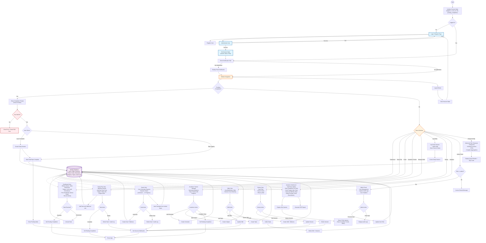

```mermaid
graph TD
    %% Entry Point
    Start((Start)) --> InitSession["Initialize Session State<br/>(logged_in, user_id, role, pending_completion)"]
    InitSession --> CheckAuth{Logged In?}

    %% Authentication Flow
    CheckAuth -- No --> LoginReg[Login / Register Page]
    LoginReg --> RegUser[Register User] -- Success --> LoginReg
    LoginReg --> Auth[Authenticate User]
    Auth -- Success --> SetState["Set Session State<br/>(UserID, Name, Role)"] --> NotifyHub
    Auth -- Fail --> LoginReg

    %% Main Application Flow
    CheckAuth -- Yes --> NotifyHub[Check Notification Hub]
    NotifyHub -- Has Notification --> ShowToast[Display Toast Notification]
    ShowToast --> Sidebar
    NotifyHub -- No Notification --> Sidebar[Sidebar Navigation]

    %% Completion Prompt System
    Sidebar --> CheckPending{Pending<br/>Completion?}
    CheckPending -- Yes --> CompPrompt["Show Completion Prompt<br/>(Hours & Notes)"]
    CompPrompt --> ValidateSkill{Has Skill ID?}
    ValidateSkill -- No --> SkillError[Show Error: Create Skill First]
    ValidateSkill -- Yes --> LogOrSkip{User Choice}
    LogOrSkip -- Log & Complete --> CreateSession[Create Study Session] --> DB
    LogOrSkip -- Skip Logging --> MarkComplete[Mark Task/Topic Complete] --> DB
    CreateSession --> MarkComplete
    MarkComplete --> ClearPending[Clear Pending State] --> Notify[Set Success Notification] --> Rerun[Rerun App]
    
    CheckPending -- No --> Menu{Menu Selection}

    %% Dashboard
    Menu -- Dashboard --> DashView["Dashboard View<br/>- Metrics (Hours, Tasks Due/Done)<br/>- Today's To-Do with Checkboxes<br/>- Time Distribution (Donut Chart)<br/>- Recent Activity"]
    DashView --> TaskCheck{Task Checked?}
    TaskCheck -- Checked --> SetPending1[Set Pending Completion] --> Rerun
    TaskCheck -- Unchecked --> UnmarkTask[Unmark Task] --> DB
    
    %% Study Plan
    Menu -- "Study Plan" --> PlanView["Study Plan View<br/>- Backlog Checker<br/>- Add New Task Form<br/>- Today's Tasks with Progress Bar"]
    PlanView --> AddTask[Add Task with Skill/Goal Link] --> DB
    PlanView --> TaskAction{Task Action}
    TaskAction -- Complete --> SetPending2[Set Pending Completion] --> Rerun
    TaskAction -- Delete --> DelTask[Delete Task + Audit Log] --> Notify
    
    %% Goals
    Menu -- Goals --> GoalView["Goals View<br/>- Auto-Calculate Progress<br/>- Dynamic Status (Achieved ↔ In Progress)"]
    GoalView --> GoalAction{Goal Action}
    GoalAction -- Add Goal --> CreateGoal[Create Goal + Balloons] --> DB
    GoalAction -- Delete Goal --> DelGoal[Delete Goal + Audit Log] --> Notify
    GoalView --> AutoCalc[Auto-Calculate from Linked Tasks] --> DB
    
    %% Academic Tracker
    Menu -- "Academic Tracker" --> AcadView["Academic Tracker<br/>- Manage Semesters/Subjects<br/>- Topic Tracker with Progress"]
    AcadView --> AcadAction{Academic Action}
    AcadAction -- Add Semester --> CreateSem[Create Semester] --> DB
    AcadAction -- Add Subject --> CreateSub[Create Subject] --> DB
    AcadAction -- Add Topic --> CreateTopic[Create Topic] --> DB
    AcadAction -- Complete Topic --> SetPending3[Set Pending Completion] --> Rerun
    
    %% Manage Skills
    Menu -- "Manage Skills" --> SkillView["Skills View<br/>- View/Edit/Delete Skills<br/>- Session Count Warning"]
    SkillView --> SkillAction{Skill Action}
    SkillAction -- Add Skill --> CreateSkill[Create Skill + Balloons] --> DB
    SkillAction -- Edit Skill --> UpdateSkill[Update Skill] --> Notify
    SkillAction -- Delete Skill --> UnlinkTasks[Unlink Tasks] --> DelSkill[Delete Skill + Sessions] --> DB
    
    %% Log Study
    Menu -- "Log Study" --> LogStudy["Log Study Session<br/>- Select Skill<br/>- Enter Hours & Notes"]
    LogStudy --> CreateManualSession[Create Study Session] --> DB
    
    %% History
    Menu -- History --> HistView["History View<br/>- Date Filter<br/>- Search Notes<br/>- Filter by Skill"]
    HistView --> HistAction{History Action}
    HistAction -- Edit Session --> UpdateSession[Update Session] --> Notify
    HistAction -- Delete Session --> DelSession[Delete Session] --> Notify
    
    %% Analytics
    Menu -- Analytics --> AnalView["Analytics Dashboard<br/>- Total Hours Metric<br/>- Task Completion Pie Chart<br/>- Goal Progress Bar Chart<br/>- Hours by Skill Bar Chart<br/>- Study & Activity Trend (Dual-Metric)"]
    AnalView --> ShowSQL[Display SQL Queries] --> SQLExpander["Show 5 SQL Queries<br/>(Total, Group By, Trends, Tasks)"]
    AnalView --> ExportPDF[Generate PDF Report]
    
    %% Admin Panel
    Menu -- "Admin Panel" --> AdminAuth{Role == admin?}
    AdminAuth -- Yes --> AdminView["Admin Panel<br/>- User Management<br/>- System Audit Logs<br/>- User Statistics"]
    AdminAuth -- No --> AccessDenied[Access Denied Message]
    AdminView --> AdminAction{Admin Action}
    AdminAction -- Promote User --> PromoteUser[Update User Role] --> DB
    AdminAction -- View Logs --> ShowLogs[Display Audit Logs]
    
    %% Advanced SQL
    Menu -- "Advanced SQL" --> SQLView["Advanced SQL Showcase<br/>- Subqueries<br/>- Window Functions<br/>- CTEs<br/>- Complex Aggregations"]
    SQLView --> SQLDemo[Display Query Results + SQL Code]
    
    %% Logout
    Sidebar --> LogoutBtn[Logout Button]
    LogoutBtn --> ClearState[Clear Session State] --> LoginReg

    %% Database Operations
    DB[(MySQL Database<br/>Users, Skills, Sessions,<br/>Tasks, Goals, Semesters,<br/>Subjects, Topics, Audit Logs)]
    DB -.-> DashView
    DB -.-> PlanView
    DB -.-> GoalView
    DB -.-> AcadView
    DB -.-> SkillView
    DB -.-> HistView
    DB -.-> AnalView
    DB -.-> AdminView
    
    %% Styling
    classDef authClass fill:#e1f5ff,stroke:#01579b,stroke-width:2px
    classDef menuClass fill:#fff3e0,stroke:#e65100,stroke-width:2px
    classDef dbClass fill:#f3e5f5,stroke:#4a148c,stroke-width:3px
    classDef criticalClass fill:#ffebee,stroke:#b71c1c,stroke-width:2px
    
    class LoginReg,Auth,SetState authClass
    class Menu,Sidebar menuClass
    class DB dbClass
    class ValidateSkill,SkillError criticalClass
```
